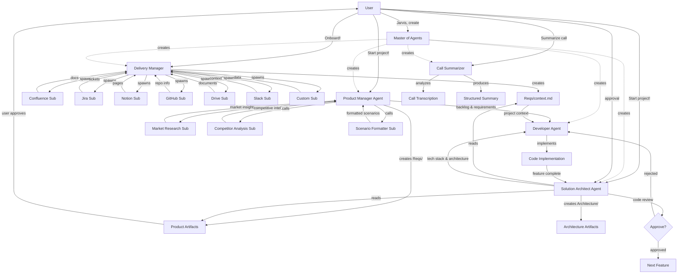

# Agent Index

**Last Updated:** 2026-04-15
**Version:** 1.1.0

This file tracks all agents, sub-agents, and skills in the system.

---

## Agents

| Name | Category | Version | Status | File |
|------|----------|---------|--------|------|
| Delivery Manager | Manager (Context Provider) | 1.0.0 | ✅ Active | `agents/delivery-manager.md` |
| Product Manager | Manager (Orchestrator) | 1.0.0 | ✅ Active | `agents/product-manager.md` |
| Solution Architect | Technical Leader | 1.0.0 | ✅ Active | `agents/solution-architect.md` |
| Developer | Action (Implementation) | 1.0.0 | ✅ Active | `agents/developer.md` |
| Master of Agents | Meta (Agent Creator) | 1.0.0 | ✅ Active | `MASTER_OF_AGENTS.md` |
| Call Summarizer | Domain-Specific (Business Analysis) | 1.0.0 | ✅ Active | `agents/call-summarizer.md` |

**Total:** 6

---

## Sub-Agents

| Name | Parent Agent | Version | Status | File |
|------|--------------|---------|--------|------|
| Confluence Fetcher Sub-Agent | Delivery Manager | 1.0.0 | ✅ Active | `sub-agents/confluence-fetcher-sub.md` |
| Jira Fetcher Sub-Agent | Delivery Manager | 1.0.0 | ✅ Active | `sub-agents/jira-fetcher-sub.md` |
| Notion Fetcher Sub-Agent | Delivery Manager | 1.0.0 | ✅ Active | `sub-agents/notion-fetcher-sub.md` |
| GitHub Context Analyzer Sub-Agent | Delivery Manager | 1.0.0 | ✅ Active | `sub-agents/github-context-analyzer-sub.md` |
| Google Drive Fetcher Sub-Agent | Delivery Manager | 1.0.0 | ✅ Active | `sub-agents/google-drive-fetcher-sub.md` |
| Slack Context Fetcher Sub-Agent | Delivery Manager | 1.0.0 | ✅ Active | `sub-agents/slack-context-fetcher-sub.md` |
| Custom Integration Sub-Agent | Delivery Manager | 1.0.0 | ✅ Active | `sub-agents/custom-integration-sub.md` |
| Market Research Sub-Agent | Product Manager | 1.0.0 | ✅ Active | `sub-agents/market-research-sub.md` |
| Competitor Analysis Sub-Agent | Product Manager | 1.0.0 | ✅ Active | `sub-agents/competitor-analysis-sub.md` |
| Scenario Formatter Sub-Agent | Product Manager | 1.0.0 | ✅ Active | `sub-agents/scenario-formatter-sub.md` |

**Total:** 10

---

## Skills

| Name | Slash Command | Version | Status | File |
|------|---------------|---------|--------|------|
| *No skills yet* | - | - | - | - |

**Total:** 0

---

## Dependency Graph

---

## Quick Stats

- **Total Entities:** 16 (6 agents + 10 sub-agents)
- **Categories Used:** 5 (Technical Leader, Manager, Action, Meta, Domain-Specific)
- **Most Common Category:** Manager
- **Most Sub-Agents:** Delivery Manager (7 sub-agents)
- **Average Dependencies:** 2.8 per agent
- **Last Agent Created:** Call Summarizer (2026-04-15)

---

## Recent Activity

### 2026-04-15
- ✅ Created Call Summarizer agent (Domain-Specific - Business Analysis)
- ✅ Registered all agents to ~/.claude/agents/ (15 total agents)
- ✅ Created COMMUNICATION_PROTOCOL.md (global agent communication standard)
- ✅ Created AGENT_MAP.md (visual ecosystem map with mermaid diagrams)
- ✅ Updated AGENT_INDEX.md to reflect all current agents
- ✅ Delivery Manager and all 7 sub-agents registered
- ✅ Product Manager and all 3 sub-agents registered
- ✅ Master of Agents registered

### 2026-03-26
- ✅ Created Delivery Manager agent (Context Provider)
- ✅ Created 7 platform integration sub-agents (Confluence, Jira, Notion, GitHub, Drive, Slack, Custom)
- ✅ Onboarding workflow established
- ✅ Context management system implemented

### 2026-03-06 (Evening)
- ✅ Created Solution Architect agent (Technical Leader)
- ✅ Added "Technical Leader" category to CATEGORIES.md
- ✅ Integrated SA with PM and Developer agents
- ✅ Code review workflow: Developer → SA approval/rejection
- ✅ Architecture artifacts creation system (8 file types)
- ✅ Three quality modes: POC, MVP, Full Charge
- ✅ Coordinated trigger: "Start project!" launches PM + SA

### 2026-03-06 (Afternoon)
- ✅ Created Product Manager agent (Manager/Orchestrator)
- ✅ Created Developer agent (Action/Implementation)
- ✅ Created Market Research Sub-Agent (for PM)
- ✅ Created Competitor Analysis Sub-Agent (for PM)
- ✅ Created Scenario Formatter Sub-Agent (for PM)
- ✅ Added "Manager" category to CATEGORIES.md
- ✅ Complete product management → development workflow

### 2026-03-04
- System initialized
- Templates created
- Master of Agents deployed

---

## Notes

This index is automatically updated by the Master of Agents when creating or updating entities.
