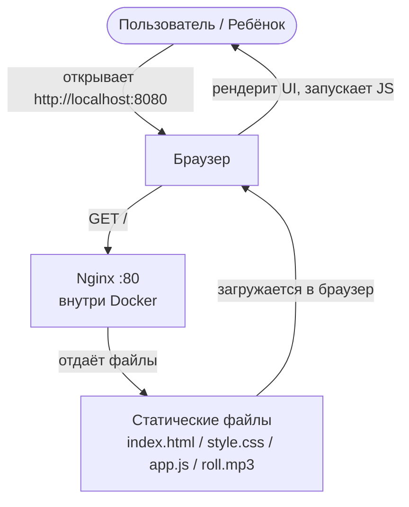
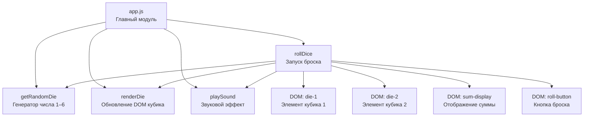
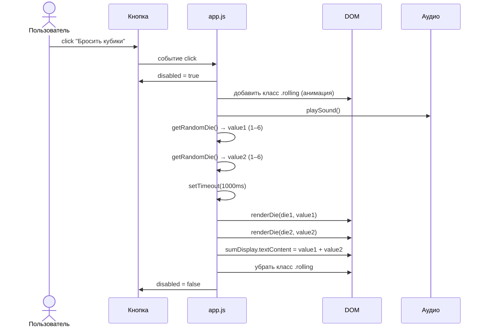
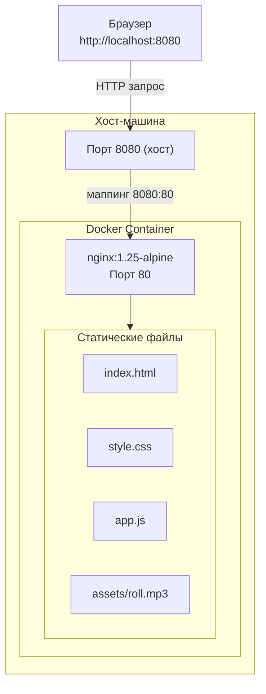

# Architecture Diagrams

**Product:** Dice Randomizer
**Last Updated:** 2026-04-30

---

## 1. System Architecture Diagram

Высокоуровневые компоненты и их взаимодействие.

---

## 2. Component Diagram

Детальная структура фронтенд-компонентов.

---

## 3. Data Flow Diagram

Как данные движутся через систему при одном броске.

---

## 4. Deployment Diagram

Инфраструктура и деплой.

