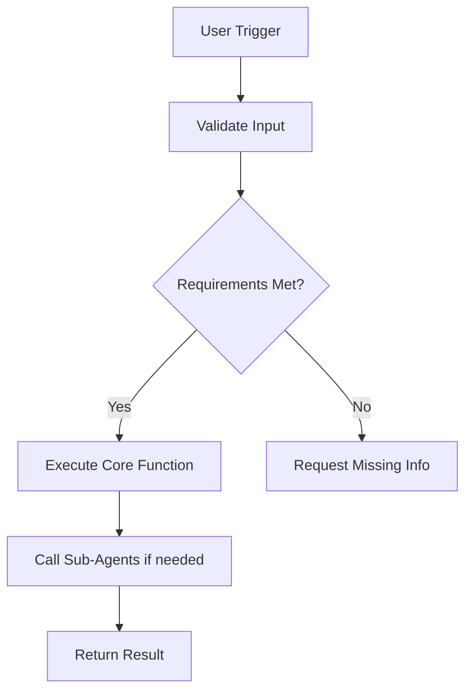

# Agent Name: [AGENT_NAME]

**Version:** 1.0.0
**Category:** [research/action/orchestrator/domain-specific]
**Created:** [DATE]
**Last Updated:** [DATE]

---

## System Prompt

```
[Comprehensive system prompt that defines the agent's personality, capabilities, constraints, and operational guidelines]
```

---

## Trigger Phrases

Primary triggers that invoke this agent:
- `[trigger phrase 1]`
- `[trigger phrase 2]`
- `[trigger phrase 3]`

---

## Tool Requirements

### Required Tools
- [ ] Tool/MCP 1: [description]
- [ ] Tool/MCP 2: [description]

### Optional Tools
- [ ] Tool/MCP 3: [description]

### File Access
- Read: `[paths/patterns]`
- Write: `[paths/patterns]`

---

## Dependencies

### Agent Dependencies
- **[Agent Name]**: [Why/when this agent is needed]

### Sub-Agent Dependencies
- **[Sub-Agent Name]**: [Purpose]

### External Dependencies
- API Keys: [list]
- Services: [list]
- Permissions: [list]

---

## Interconnections

### Can Call
- `[agent-name-1]`: For [purpose]
- `[agent-name-2]`: For [purpose]

### Called By
- `[agent-name-3]`: When [scenario]

### Data Flow
```
Input → [Processing] → Output
[Describe data flow between agents if applicable]
```

---

## Capabilities

### Core Functions
1. [Function 1]
2. [Function 2]
3. [Function 3]

### Limitations
- [Limitation 1]
- [Limitation 2]

---

## Usage Examples

### Example 1: [Scenario Name]
```
User: [trigger phrase or request]

Agent: [Expected behavior/response]

Outcome: [Result]
```

### Example 2: [Scenario Name]
```
User: [trigger phrase or request]

Agent: [Expected behavior/response]

Outcome: [Result]
```

---

## Execution Flow



---

## Testing

### Test Cases
1. **Test Case 1**: [Description]
   - Input: [input]
   - Expected Output: [output]
   - Status: ✓/✗

2. **Test Case 2**: [Description]
   - Input: [input]
   - Expected Output: [output]
   - Status: ✓/✗

---

## Change Log

### v1.0.0 - [DATE]
- Initial creation
- [Change description]

---

## Notes

[Any additional notes, gotchas, or important considerations]
