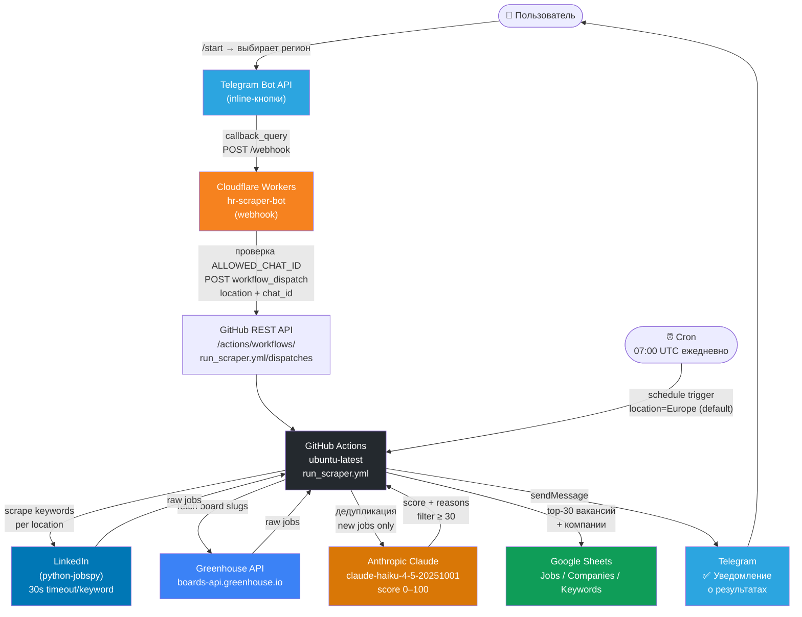

# HR Scraper — Техническая документация

## Краткая справка

**HR Scraper** — персональный инструмент автоматического поиска вакансий и оценки их соответствия резюме. Система ежедневно сканирует LinkedIn и Greenhouse, оценивает каждую вакансию через Claude AI, отбирает топ-30 по релевантности и записывает результаты в Google Sheets.

**Для кого:** индивидуальное использование — владелец управляет поиском через Telegram-бота одной кнопкой выбора региона. Никакого локального сервера, всё работает бесплатно в облаке.

**Ключевые характеристики:**
- Полностью serverless: GitHub Actions + Cloudflare Workers
- Управление через Telegram inline-кнопки
- Scoring через Claude (claude-haiku-4-5-20251001): score 0–100, причины совпадения/несоответствия
- Дедупликация: вакансии не повторяются между запусками
- Расписание: ежедневно в 10:00 по Хельсинки (07:00 UTC), плюс ручной запуск из Telegram

---

## Сервисы и технологии

| Сервис | Роль |
|---|---|
| **GitHub Actions** | Бесплатный облачный runner (ubuntu-latest). Два триггера: `schedule` (cron `0 7 * * *`) и `workflow_dispatch` (вызов через API из Telegram). Запускает Python-оркестратор. Лимит: 2000 мин/месяц бесплатно, один прогон ~5–8 мин. |
| **Cloudflare Workers** | Бесплатный serverless JavaScript webhook. Принимает callback_query и текстовые команды от Telegram Bot API, вызывает GitHub API для запуска workflow. Имя воркера: `hr-scraper-bot`. |
| **Telegram Bot API** | Пользовательский интерфейс: inline-кнопки выбора региона, уведомление о результатах по завершении. Безопасность: проверка `ALLOWED_CHAT_ID` — бот игнорирует все чаты кроме владельца. |
| **Google Sheets API v4** | Хранилище результатов. Три вкладки: `Jobs` (вакансии), `Companies` (компании, счётчик вакансий), `Keywords` (активные поисковые запросы). Аутентификация: Service Account JSON. |
| **Anthropic Claude API** | Модель `claude-haiku-4-5-20251001`. Получает текст CV (до 3000 символов) и описание вакансии (до 2000 символов), возвращает JSON: `{score, match_reasons, gap_reasons}`. Вакансии с score ниже 30 отбрасываются. |
| **python-jobspy** | Python-библиотека для скрапинга LinkedIn. Обходит bot-detection. Таймаут 30 секунд на один поисковый запрос через `ThreadPoolExecutor`. |
| **Greenhouse API** | Официальный публичный API `boards-api.greenhouse.io/v1/boards/{slug}/jobs`. Скрапинг конкретных компаний по board slug. |
| **pdfplumber** | Парсинг резюме из `cv.pdf` в текст для передачи в Claude. |
| **Wrangler / wrangler-action@v3** | Автодеплой Cloudflare Worker из GitHub Actions при изменении `bot/worker.js` или `bot/wrangler.toml`. |

---

## Workflow

### Ручной запуск через Telegram

```
1. Пользователь → /start или /run
2. Бот отвечает inline-клавиатурой с 5 регионами
3. Пользователь нажимает кнопку, например "🌊 Baltic"
4. Cloudflare Worker получает callback_query
5. Worker проверяет ALLOWED_CHAT_ID (безопасность)
6. Worker: POST https://api.github.com/repos/zatitskiyrb/GDrive_Repo/
           actions/workflows/run_scraper.yml/dispatches
   inputs: { location: "Baltic", telegram_chat_id: "..." }
7. GitHub API возвращает HTTP 204 — запуск поставлен в очередь
8. Worker редактирует сообщение: "🚀 Запускаю поиск... (~5 мин)"
```

### Автоматический запуск по расписанию

```
Каждый день в 07:00 UTC (10:00 Helsinki) GitHub cron
запускает workflow с location="" → main.py читает
default location из config.yaml ("Europe")
```

### Выполнение main.py на GitHub Actions runner

```
Шаг 1. Инициализация
  - Установка зависимостей (pip install)
  - Запись GOOGLE_SERVICE_ACCOUNT_JSON в файл
  - Парсинг cv.pdf через pdfplumber
  - Загрузка кэша дедупликации (data/processed_urls.json)

Шаг 2. Google Sheets
  - Подключение через Service Account
  - Создание вкладок Jobs/Companies/Keywords если отсутствуют
  - Инициализация Keywords дефолтными значениями если вкладка пуста

Шаг 3. Разворачивание пресета локации
  - "Baltic"         → ["Estonia", "Latvia", "Lithuania"]
  - "Scandinavia"    → ["Sweden", "Norway", "Denmark", "Finland", "Iceland"]
  - "Eastern Europe" → ["Poland", "Czech Republic", "Slovakia",
                         "Hungary", "Romania", "Bulgaria"]
  - "Europe"         → ["Europe"] (передаётся в LinkedIn как есть)
  - "Remote"         → ["Remote"] (передаётся как есть)

Шаг 4. Скрапинг (для каждой страны из списка)
  a) LinkedIn (python-jobspy):
     - Для каждого keyword: scrape_jobs(..., timeout=30s)
     - Таймаут через ThreadPoolExecutor.Future.result(timeout=30)
     - 1 секунда задержки между запросами (rate limiting)
     - При таймауте — keyword пропускается, выводится warning
  b) Greenhouse:
     - Для каждого board slug из config.yaml
     - GET boards-api.greenhouse.io/v1/boards/{slug}/jobs
     - Фильтрация по keyword (title match) и location
     - 0.3 секунды задержки между board-запросами

Шаг 5. Дедупликация
  - Внутри прогона: убирает дубли по job_url (set)
  - Против кэша: убирает URL из processed_urls.json
  - Против Google Sheets: убирает URL уже записанных вакансий

Шаг 6. Scoring через Claude
  - Каждая новая вакансия → запрос к Claude API
  - Промпт: CV text (≤3000 chars) + job description (≤2000 chars)
  - Ответ: { score: 0–100, match_reasons: [...], gap_reasons: [...] }
  - Вакансии с score < 30 (min_score из config.yaml) отбрасываются
  - Топ-30 по убыванию score (daily_limit из config.yaml)

Шаг 7. Запись в Google Sheets
  - Вкладка Companies: find_or_create для каждой компании
  - Вкладка Jobs: append_jobs (топ-30)
  - Вкладка Companies: update_job_counts (пересчёт)

Шаг 8. Обновление кэша
  - В processed_urls.json сохраняются ВСЕ собранные URL
    (не только топ-30), чтобы при следующем запуске
    малорелевантные вакансии не скрапились повторно

Шаг 9. Telegram-уведомление
  - POST /sendMessage в чат пользователя:
    "✅ Поиск завершён!
     📍 Локация: Baltic
     💼 Новых вакансий: 12
     📊 Открой таблицу: https://docs.google.com/..."
```

---

## Архитектурная схема



---

## Конфигурация

### GitHub Secrets

| Секрет | Назначение |
|---|---|
| `ANTHROPIC_API_KEY` | Claude API — scoring вакансий |
| `GOOGLE_SHEET_ID` | ID таблицы Google Sheets |
| `GOOGLE_SERVICE_ACCOUNT_JSON` | JSON Service Account для Google API |
| `TELEGRAM_BOT_TOKEN` | Токен Telegram-бота (отправка уведомлений из Python) |
| `CLOUDFLARE_API_TOKEN` | Автодеплой Worker через wrangler-action |

### Cloudflare Worker Variables (Dashboard → Workers → Settings → Variables)

| Переменная | Назначение |
|---|---|
| `TELEGRAM_TOKEN` | Токен бота (отправка сообщений из Worker) |
| `GITHUB_TOKEN` | PAT с правами `repo` (вызов workflow_dispatch) |
| `ALLOWED_CHAT_ID` | Telegram chat ID владельца (whitelist) |
| `GITHUB_REPO` | Задан в `wrangler.toml` как `[vars]` — не нужно добавлять вручную |

### Параметры config.yaml

| Параметр | Значение по умолчанию | Описание |
|---|---|---|
| `search.location` | `"Europe"` | Регион по умолчанию (при cron-запуске) |
| `search.date_posted_days` | `1` | Глубина поиска в днях |
| `search.daily_limit` | `30` | Максимум вакансий в выходном файле |
| `scoring.model` | `claude-haiku-4-5-20251001` | Модель Claude |
| `scoring.min_score` | `30` | Минимальный порог релевантности |

---

## Файловая структура

```
Practice 4 (HR scraper)/
├── bot/
│   ├── worker.js          # Cloudflare Worker: Telegram webhook + GitHub API trigger
│   └── wrangler.toml      # Worker config: имя, GITHUB_REPO var
└── hr_scraper/
    ├── main.py            # Оркестратор: управляет всем pipeline
    ├── config.yaml        # Настройки: keywords, лимиты, модель, Greenhouse boards
    ├── cv.pdf             # Резюме пользователя (используется для scoring)
    ├── scrapers/
    │   ├── base.py        # Базовый класс скрапера
    │   ├── linkedin.py    # LinkedIn через jobspy (30s timeout per keyword)
    │   └── greenhouse.py  # Greenhouse boards API
    ├── scoring/
    │   └── affinity.py    # Claude scoring: промпт, вызов API, парсинг JSON
    ├── sheets/
    │   ├── client.py      # Подключение к Google Sheets (Service Account)
    │   ├── jobs.py        # Операции с вкладкой Jobs
    │   ├── companies.py   # Операции с вкладкой Companies
    │   └── keywords.py    # Операции с вкладкой Keywords
    ├── models/
    │   └── schemas.py     # Pydantic-схемы: Job, AffinityResult
    └── utils/
        ├── cv_parser.py   # Парсинг PDF резюме (pdfplumber)
        └── dedup.py       # URL-кэш дедупликации (data/processed_urls.json)

.github/workflows/
├── run_scraper.yml        # Основной workflow: cron + workflow_dispatch
└── deploy_worker.yml      # Автодеплой Worker при изменении bot/worker.js
```

---

## Автодеплой Cloudflare Worker

`deploy_worker.yml` следит за изменениями в `bot/worker.js` и `bot/wrangler.toml`. При любом push в `main`, затрагивающем эти файлы, запускается `cloudflare/wrangler-action@v3`, который деплоит Worker через Cloudflare API. Ручной деплой не требуется — достаточно закоммитить изменения в бот.

---

## Известные ограничения

- **Indeed недоступен** в облачных runner-ах — bot-detection блокирует запросы. Используются только LinkedIn и Greenhouse.
- **LinkedIn таймауты** — поиск по одному keyword ограничен 30 секундами. При таймауте keyword пропускается с предупреждением, pipeline продолжается.
- **GitHub Actions лимит** — 2000 минут бесплатно в месяц. Один прогон ~5–8 минут (~7–12% лимита при ежедневном запуске).
- **Кэш дедупликации** — `data/processed_urls.json` хранится в репозитории и коммитится обратно при каждом запуске.
- **Scoring стоимость** — каждая вакансия = один запрос к Claude Haiku (минимальная стоимость из всех моделей).
